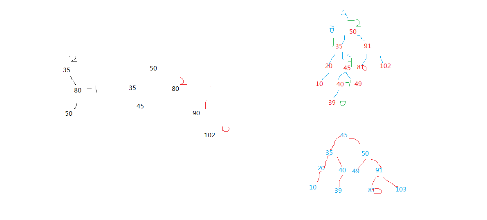
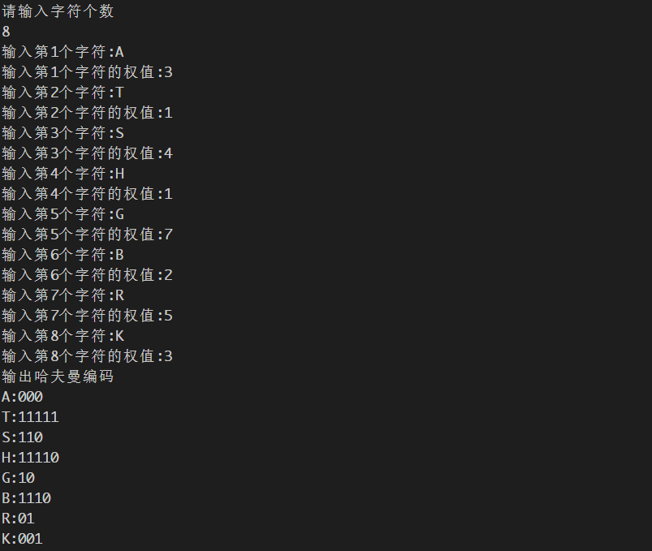

## 实验11-平衡树、哈夫曼树

### 1、平衡树是左子树与右子树的高度之差的绝对值小于等于1的二叉排序树。现有输入序列：35  80  50  90  45  102  20  40  49  10  39 请根据输入序列，画出其对应的平衡树。

                    45
                /        \
            35              50
          /     \         /    \
        20      40      49      91
      /       /               /     \
    10      39              80      102

#### 草稿:

### 2、已知某报文使用到的字符有8个：A,T,S,H,G,B,R,K，各种字符分别出现3次、1次、4次、1次、7次、2次、5次和3次，请以这8个字符的出现次数作为字符的权值，构造出哈夫曼树，写出这8个字符对应的哈夫曼编码。

| 字符           |  A  |  T  |  S  |  H  |  G  |  B  |  R  |  K  |
| ------------- |:---:|:---:|:---:|:---:|:---:|:---:|:---:|:---:|
| 哈夫曼编码      | 000 | 11111 | 110 | 11110 | 10 | 1110 | 01 | 001 |

#### 源代码: [点此查看](./实验11-完整代码/ex_11.cpp)

#### 运行截图:

